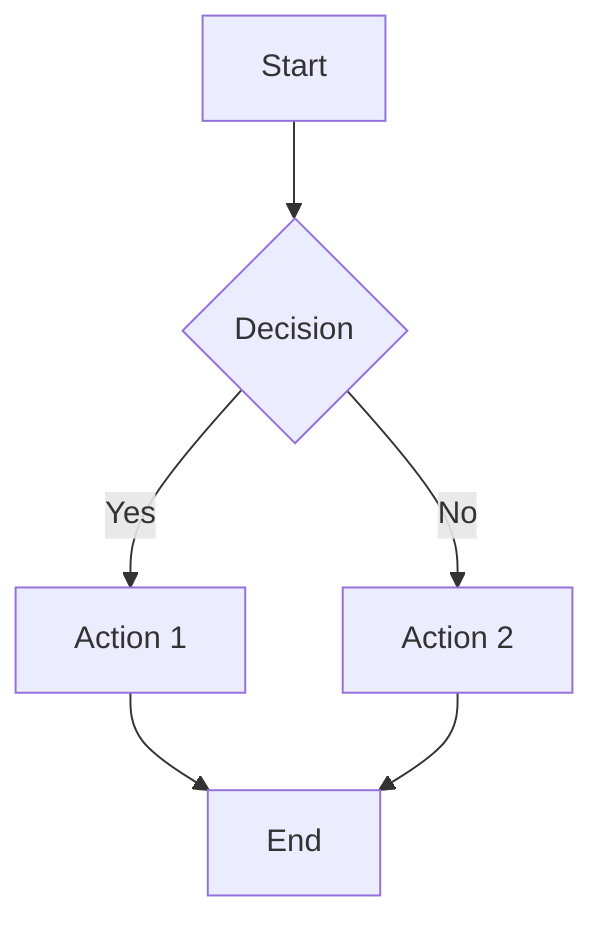

# Examples

This page demonstrates various features and components available in the custom MkDocs theme.

## Code Examples

### Python

```python
def fibonacci(n):
    """Calculate the nth Fibonacci number."""
    if n <= 1:
        return n
    return fibonacci(n-1) + fibonacci(n-2)

# Example usage
for i in range(10):
    print(f"F({i}) = {fibonacci(i)}")
```

### JavaScript

```javascript
// Modern JavaScript with ES6+ features
class DocumentationSite {
  constructor(name, url) {
    this.name = name;
    this.url = url;
    this.initialized = false;
  }

  async initialize() {
    try {
      await this.loadAssets();
      this.setupEventListeners();
      this.initialized = true;
      console.log(`${this.name} initialized successfully`);
    } catch (error) {
      console.error('Initialization failed:', error);
    }
  }

  loadAssets() {
    return new Promise((resolve) => {
      // Simulate asset loading
      setTimeout(resolve, 1000);
    });
  }

  setupEventListeners() {
    document.addEventListener('DOMContentLoaded', () => {
      this.onDOMReady();
    });
  }

  onDOMReady() {
    console.log('DOM is ready!');
  }
}

// Usage
const site = new DocumentationSite('Custom MkDocs', 'https://example.com');
site.initialize();
```

### CSS

```css
/* Modern CSS with custom properties */
:root {
  --primary-color: #667eea;
  --secondary-color: #764ba2;
  --text-color: #2c3e50;
  --bg-color: #f8f9fa;
  --border-radius: 8px;
  --shadow: 0 2px 10px rgba(0, 0, 0, 0.1);
}

.card {
  background: white;
  border-radius: var(--border-radius);
  box-shadow: var(--shadow);
  padding: 1.5rem;
  transition: transform 0.3s ease;
}

.card:hover {
  transform: translateY(-2px);
}

/* Responsive design */
@media (max-width: 768px) {
  .card {
    padding: 1rem;
    margin-bottom: 1rem;
  }
}
```

## Interactive Components

### Tabs

=== "Tab 1"
Content for tab 1 goes here.

=== "Tab 2"
Content for tab 2 goes here.

=== "Tab 3"
Content for tab 3 goes here.

### Code Blocks with Copy

```bash
# Install dependencies
npm install mkdocs mkdocs-material

# Start development server
mkdocs serve

# Build for production
mkdocs build
```

## Layout Examples

### Hero Section

<div class="hero-section">
    <h1 class="hero-title">Example Hero</h1>
    <p class="hero-subtitle">This is an example hero section with custom styling</p>
    <a href="#" class="hero-cta">Get Started</a>
</div>

### Card Grid

<div style="display: grid; grid-template-columns: repeat(auto-fit, minmax(300px, 1fr)); gap: 1rem; margin: 2rem 0;">
    <div class="card">
        <h3 class="card-title">Feature 1</h3>
        <p class="card-content">Description of the first feature with detailed information.</p>
    </div>
    <div class="card">
        <h3 class="card-title">Feature 2</h3>
        <p class="card-content">Description of the second feature with detailed information.</p>
    </div>
    <div class="card">
        <h3 class="card-title">Feature 3</h3>
        <p class="card-content">Description of the third feature with detailed information.</p>
    </div>
</div>

## Typography Examples

### Headings

# H1 Heading

## H2 Heading

### H3 Heading

#### H4 Heading

##### H5 Heading

###### H6 Heading

### Text Formatting

**Bold text** and _italic text_ and `inline code`.

~~Strikethrough text~~ and ==highlighted text==.

### Lists

#### Unordered List

- Item 1
- Item 2
  - Nested item 2.1
  - Nested item 2.2
- Item 3

#### Ordered List

1. First item
2. Second item
3. Third item

### Blockquotes

> This is a blockquote example.
>
> It can span multiple lines and provides
> a nice way to highlight important information.

### Tables

| Feature           | Status         | Description                     |
| ----------------- | -------------- | ------------------------------- |
| Custom Theme      | ✅ Complete    | Fully functional custom theme   |
| PostCSS           | ✅ Complete    | CSS processing and optimization |
| GitHub Actions    | ✅ Complete    | Automated build and deployment  |
| Mobile Responsive | ✅ Complete    | Works on all device sizes       |
| Search            | 🔄 In Progress | Basic search functionality      |

## Advanced Examples

### Math Equations

Inline math: $E = mc^2$

Block math:

$$
\int_{-\infty}^{\infty} e^{-x^2} dx = \sqrt{\pi}
$$

### Mermaid Diagrams



### Admonitions

!!! note "Note"
This is a note admonition with important information.

!!! tip "Tip"
This is a tip admonition with helpful advice.

!!! warning "Warning"
This is a warning admonition with cautionary information.

!!! danger "Danger"
This is a danger admonition with critical information.

## Performance Metrics

| Metric                   | Value | Target |
| ------------------------ | ----- | ------ |
| First Contentful Paint   | 1.2s  | < 2s   |
| Largest Contentful Paint | 2.1s  | < 2.5s |
| Cumulative Layout Shift  | 0.05  | < 0.1  |
| Time to Interactive      | 2.8s  | < 3s   |

## Browser Support

| Browser | Version | Support    |
| ------- | ------- | ---------- |
| Chrome  | 90+     | ✅ Full    |
| Firefox | 88+     | ✅ Full    |
| Safari  | 14+     | ✅ Full    |
| Edge    | 90+     | ✅ Full    |
| IE      | 11      | ⚠️ Limited |
